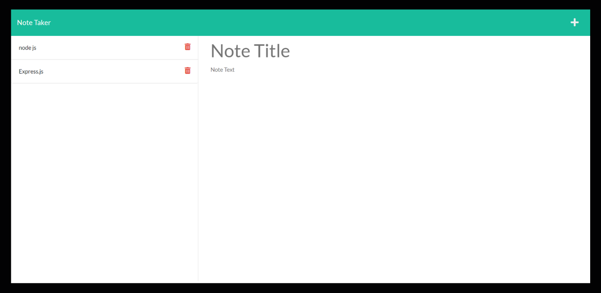

# Note Taker
        
## 🌟[Description](#table-of-contents)
A note-taking application that can be used to create, save, and delete notes. This application uses an express backend, saving and retrieving JSON-stored data.

<p>
    
    
    
    
    
    
    
</p>

## Table-of-Contents
* [Description](#description)
* [User Story](#User-Stor)
* [Acceptance Criteria](#Acceptance-Criteria)
* [Mock-Up](#Mock-Up)
* [Installation](#installation)
* [License](#License)
* [Contributing](#contributing)
* [FAQs](#faqs)
  

## 👤 [User Story](#table-of-contents)

``` 
AS A small business owner
I WANT to be able to write and save notes
SO THAT I can organize my thoughts and keep track of tasks I need to complete
```


## 🔑 [Acceptance Criteria](#table-of-contents)

```
GIVEN a note-taking application
WHEN I open the Note Taker
THEN I am presented with a landing page with a link to a notes page
WHEN I click on the link to the notes page
THEN I am presented with a page with existing notes listed in the left-hand column, plus empty fields to enter a new note title and the note’s text in the right-hand column
WHEN I enter a new note title and the note’s text
THEN a Save icon appears in the navigation at the top of the page
WHEN I click on the Save icon
THEN the new note I have entered is saved and appears in the left-hand column with the other existing notes
WHEN I click on an existing note in the list in the left-hand column
THEN that note appears in the right-hand column
WHEN I click on the Write icon in the navigation at the top of the page
THEN I am presented with empty fields to enter a new note title and the note’s text in the right-hand column
```

## 📺 [Mock-Up](#table-of-contents)




## ⚙️ [Installation](#table-of-contents)
Use your terminal to clone or download or copy the zip file to a directory of your choice. Then open the file in VS Code or whatever editor you use. In VS Code, open the terminal and navigate to Note Taker in the root directory. Now you can run the application!
         
## 📑 [License](#table-of-contents)


Your repository is licensed under an mit open source license, so other people can contribute more easily.More information can be found by clicking this [link.](https://choosealicense.com/licenses/mit)

## 🤝 [Contributing](#table-of-contents)
We are open to all kinds of contributions. If you want to:
* 🤔 Suggest a feature
* 🐛 Report an issue
* 📖 Improve documentation
* 👨‍💻 Contribute to the code

We are excited that you are reading this and are willing to contribute. No need to think big. Even a typo fix might save our day and make you a hero. Every contribution counts!
     
Feel free to check [issues page](https://github.com/VimukthiGunasekara/note-taker/issues) 
     
## 🤔 [FAQs](#table-of-contents)
Please contact me using the following links:

[GitHub](https://github.com/VimukthiGunasekara) / Email: vimukthisadaruwan65@gmail.com
